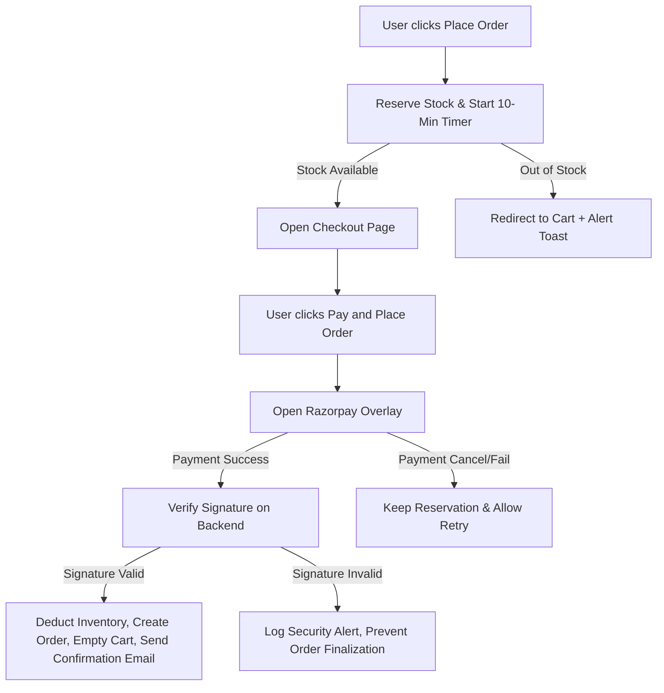
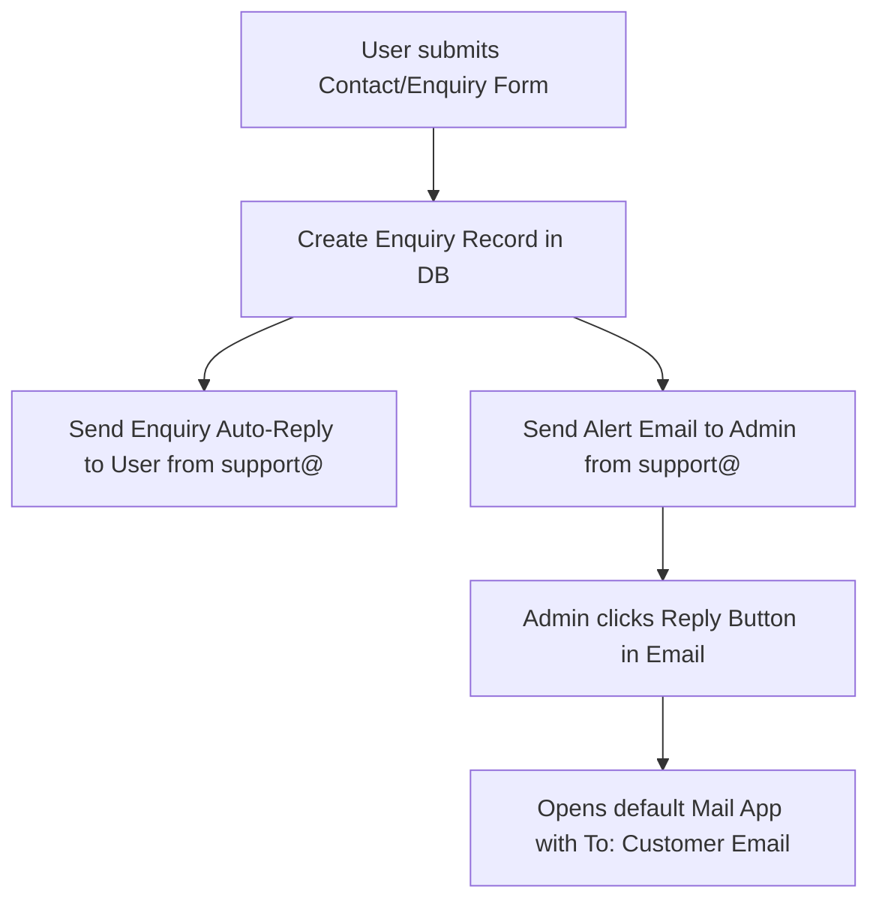

# 📝 Product Requirement Document (PRD) — UpharVilla

## 1. Product Overview & Vision
**UpharVilla** is a premium e-commerce platform specializing in curated gifts. The vision is to deliver a seamless, high-end shopping experience, ensuring inventory integrity (no double-selling) and building customer trust through prompt, automated, and beautifully designed communication at every stage of the customer lifecycle.

---

## 2. Core Features & Requirements

### 🛍️ Feature 1: Inventory Lock & Stock Reservation
* **Goal:** Prevent inventory overselling (two customers buying the same single item at the exact same moment).
* **Requirements:**
  * When a customer enters the `/checkout` page, their selected items must be reserved (locked) in the database.
  * Stock locks must expire exactly **10 minutes** after creation if checkout is not completed.
  * A visual countdown timer (from 10:00 down to 00:00) must be displayed to the user during checkout.
  * If the timer runs out, the locked stock is automatically released back to the store inventory, and the user is prompted to restart checkout.
  * If a user manually exits checkout or returns to the cart, the stock lock must be immediately released.

### 💳 Feature 2: Secure Razorpay Checkout
* **Goal:** Provide a trusted, secure, and modern payment gateway integration.
* **Requirements:**
  * Create payments using Razorpay's API in the backend.
  * Load Razorpay's SDK dynamically on the checkout page.
  * **Backend Verification:** Payment completion *must* verify the cryptographic HMAC signature (`razorpay_signature`) on the server before finalizing the order.
  * Upon successful verification, the backend must:
    1. Permanently deduct the reserved stock from product inventories.
    2. Convert the stock reservation status from `"reserved"` to `"completed"`.
    3. Empty the customer's cart.
    4. Save the order record with detailed status trackers.
    5. Trigger confirmation emails.

### 📧 Feature 3: Branded Transactional Email System
* **Goal:** Elevate UpharVilla’s brand presence through automated, professional notifications that match the site's styling (lavender purple `#ad8de9`, pink accent `#e87fa6`, and Libre Baskerville fonts).
* **Requirements:**
  * **Domain Authenticated Senders:** Deliver emails from appropriate verified domains (`orders@upharvilla.in`, `support@upharvilla.in`, `hello@upharvilla.in`).
  * **Real-time Notifications:**
    * **Customer Order Confirmation:** Sent instantly after successful payment with product summaries, pricing, and shipping addresses.
    * **Admin Order Alert:** Instantly notifies store administrators of new orders.
    * **Customer Enquiry Auto-Response:** Sent instantly when a contact form is submitted, promising a reply within 24 hours.
    * **Admin Enquiry Alert:** Instantly forwards enquiry details to admin with a one-click `mailto` link to reply.
  * **Scheduled & Automated Emails (Cron-driven):**
    * **Abandoned Cart Follow-Up:** Sent daily to users who left items in their cart for more than 24 hours without completing a purchase.
    * **Order Packing Reminder:** Sent automatically to notify customers their gifts are being packed.
    * **Thank-You Confirmation:** Sent post-delivery to celebrate the delivery of their gift.
    * **Star-Rating Review Request:** Sent 48–72 hours post-delivery, displaying 5 clickable star emojis linked directly to specific rating presets.

---

## 3. User Flows

### A. Checkout & Payment Flow

### B. Enquiry & Support Flow

---

## 4. Key Performance Indicators (KPIs)
* **Double-Selling Rate:** 0% (ensured by stock reservations).
* **Email Open Rate Target:** >45% (supported by custom verified domains and personalized subject lines).
* **Cart Recovery Rate:** Target 15% recovery of abandoned carts through automated follow-ups.
