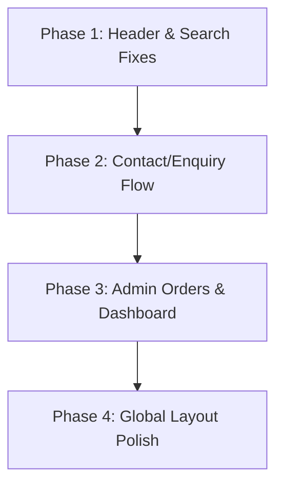

# 🔍 Website Audit & Roadmap Report — UpharVilla

We have completed a comprehensive audit of the UpharVilla website by reviewing the frontend pages, backend queries/mutations/crons, and testing the user-facing interactions using browser subagents.

Below is a detailed report on what is currently functioning, the core gaps and bugs identified, and the specific next steps to complete the platform.

---

## 1. What is Currently Implemented

### 🛍️ Stock Reservation & Inventory Lock
* **Checkout Lock:** When a logged-in user enters `/checkout`, their cart items are locked in the database via `reserveStock` mutation.
* **10-Minute Expiry:** Active stock locks expire after 10 minutes (`expiresAt` timestamp check).
* **Countdown Ticker:** A visual countdown timer (10:00 to 00:00) is displayed on `/checkout`.
* **Lock Purging:** A daily database cleanup cron (`database-cleanup`) automatically purges expired locks.

### 💳 Payments Integration
* **Razorpay Web SDK:** Loaded dynamically on the checkout page.
* **Authorization Security:** Order amounts are computed authoritative on the server inside `createRazorpayOrder` to prevent client-side price manipulation.
* **Server Verification:** Payment signatures are securely verified on the server using **Web Crypto APIs** (HMAC-SHA256) inside `completeCheckout` before final order confirmation and cart clearance.

### 📧 Transactional Email System (Brevo REST API)
* Uses native `fetch` inside Convex actions to call the Brevo SMTP API, avoiding compatibility warnings.
* Beautifully designed, brand-themed HTML templates matching UpharVilla's aesthetic (lavender purple `#ad8de9`, accent pink `#e87fa6`, and serif typography).
* **Sender Routing:** Automated routing from custom verified subdomains (`orders@upharvilla.in`, `support@upharvilla.in`) with fallback configuration.

### ⏰ Cron Tasks (`convex/crons.ts`)
* **10:00 AM IST:** Send order packing reminders.
* **11:00 AM IST:** Send abandoned cart recovery emails.
* **12:00 PM IST:** Send post-delivery thank-you emails.
* **01:00 PM IST:** Send rating and review requests (48-72h post-delivery).
* **04:00 AM IST:** Purge expired reservations and 30-day abandoned carts.

---

## 2. Core Functional Gaps & Issues Identified

We identified several critical gaps and styling issues that prevent the site from being a fully production-ready e-commerce platform.

### 🔴 Issue 1: Search Bar has No Input Element
* **File:** [SearchBar.tsx](file:///c:/Users/Ritesh%20Sinha/OneDrive/Desktop/Client_Projects/upharvilla/src/modules/user/components/SearchBar.tsx)
* **Problem:** The search bar displays a beautiful typewriter animation as a placeholder, but it has **no `<input>` element**. Users cannot click to focus, type search queries, or submit searches.
* **Impact:** The search function is completely unusable.

### 🔴 Issue 2: Navigation Dropdowns Do Not Open
* **Files:** [Navigation.tsx](file:///c:/Users/Ritesh%20Sinha/OneDrive/Desktop/Client_Projects/upharvilla/src/modules/user/components/Navigation.tsx) and [NavBar.tsx](file:///c:/Users/Ritesh%20Sinha/OneDrive/Desktop/Client_Projects/upharvilla/src/modules/user/components/NavBar.tsx)
* **Problem:** Clicking or hovering over category headers (e.g., *Customized Gifts, Corporate Gifts, Hampers*) does not display the dropdown sublinks.
* **Root Cause:** 
  1. `NavBar.tsx` has a negative margin `-mt-16` shifting the navigation bar upwards, causing overlapping layers that block mouse interactions.
  2. The custom tailwind classes ending in `!` (e.g., `md:absolute!`, `md:w-[1000px]!`) might be conflicting with dropdown layouts.
  3. The `value={openItem}` and `onValueChange={setOpenItem}` state is controlled but has no mouse-trigger handler mapping in the dropdown structure.

### 🔴 Issue 3: Cart & Wishlist Icons Hidden for Logged-Out Users
* **File:** [Header.tsx](file:///c:/Users/Ritesh%20Sinha/OneDrive/Desktop/Client_Projects/upharvilla/src/modules/user/components/Header.tsx)
* **Problem:** The Phone, Wishlist, and Cart buttons in the top header are only rendered within the `session ? (...) : (...)` block. Logged-out (guest) users cannot see or access their cart/wishlist.
* **Impact:** Bad UX. Users expect to see their cart status and be prompted to sign in when clicking to add/view items.

### 🔴 Issue 4: Contact/Enquiry Flow is Missing (DB, Mutation & Form Page)
* **Files:** [schema.ts](file:///c:/Users/Ritesh%20Sinha/OneDrive/Desktop/Client_Projects/upharvilla/convex/schema.ts) and [Footer.tsx](file:///c:/Users/Ritesh%20Sinha/OneDrive/Desktop/Client_Projects/upharvilla/src/modules/user/components/Footer.tsx)
* **Problem:** 
  1. The DB schema does not have an `enquiries` table, even though the PRD flow charts state "Create Enquiry Record in DB".
  2. There is no public Convex mutation or action to submit a contact form and trigger the backend notification emails (`sendEnquiryAutoReply` and `notifyAdminNewEnquiry` are internal actions).
  3. The "Contact Us" footer link points to `#` and no `/contact` page exists.

### 🔴 Issue 5: Missing Admin Order Management & Placeholder Dashboard
* **Files:** [AppSidebar.tsx](file:///c:/Users/Ritesh%20Sinha/OneDrive/Desktop/Client_Projects/upharvilla/src/modules/admin/components/AppSidebar.tsx) and [admin/page.tsx](file:///c:/Users/Ritesh%20Sinha/OneDrive/Desktop/Client_Projects/upharvilla/src/app/(admin)/admin/page.tsx)
* **Problem:**
  1. The new-order admin email links to `/admin/orders`, but this route does not exist. The admin cannot view, ship, or deliver orders.
  2. The main Admin Dashboard `/admin` is a blank page showing only "Welcome [Admin Name]". It has no statistics, graphs, or recent activities.

### 🟡 Issue 6: Footer Code Duplication
* **Files:** [page.tsx](file:///c:/Users/Ritesh%20Sinha/OneDrive/Desktop/Client_Projects/upharvilla/src/app/(ecommerce)/page.tsx), [product/[id]/page.tsx](file:///c:/Users/Ritesh%20Sinha/OneDrive/Desktop/Client_Projects/upharvilla/src/app/(ecommerce)/product/[id]/page.tsx)
* **Problem:** The `<Footer />` is imported and rendered on individual pages. The Cart page, Wishlist page, and Checkout page either duplicate this or miss it entirely.
* **Recommendation:** Move the footer into `(ecommerce)/layout.tsx` to handle it globally.

---

## 3. Recommended Next Steps (Roadmap)

To fix the gaps above, we recommend executing the following tasks in order:



### Phase 1: Header, Navigation & Search Fixes
1. **Fix Search:** Modify [SearchBar.tsx](file:///c:/Users/Ritesh%20Sinha/OneDrive/Desktop/Client_Projects/upharvilla/src/modules/user/components/SearchBar.tsx) to render a proper text `<input>` element. Keep the typewriter animation overlay/floating when the field is empty, and redirect the user to `/products?search=[query]` on submit.
2. **Fix Dropdowns:** Debug the layout of [NavBar.tsx](file:///c:/Users/Ritesh%20Sinha/OneDrive/Desktop/Client_Projects/upharvilla/src/modules/user/components/NavBar.tsx) and [Navigation.tsx](file:///c:/Users/Ritesh%20Sinha/OneDrive/Desktop/Client_Projects/upharvilla/src/modules/user/components/Navigation.tsx) to remove overlapping layers (specifically checking the `-mt-16` margin) so hover triggers display the menu correctly.
3. **Expose Guest Cart/Wishlist:** Update [Header.tsx](file:///c:/Users/Ritesh%20Sinha/OneDrive/Desktop/Client_Projects/upharvilla/src/modules/user/components/Header.tsx) to show the Cart and Wishlist icons to all users. If logged out, set counts to `0` and redirect clicks to `/auth` (or show empty pages).

### Phase 2: Contact Form & Enquiries System
1. **Schema Update:** Add the `enquiries` table to [schema.ts](file:///c:/Users/Ritesh%20Sinha/OneDrive/Desktop/Client_Projects/upharvilla/convex/schema.ts):
   ```typescript
   enquiries: defineTable({
     name: v.string(),
     email: v.string(),
     phone: v.optional(v.string()),
     message: v.string(),
     createdAt: v.number(),
   })
   ```
2. **Convex Mutation:** Write a mutation `enquiries:submit` that validates user inputs, saves them to the `enquiries` table, and runs the internal actions to send confirmation emails to both the client and the admin.
3. **Contact Page UI:** Build a beautiful contact page at `src/app/(ecommerce)/contact/page.tsx` with a premium form layout.

### Phase 3: Admin Orders Management & Dashboard
1. **Create Orders Route:** Create `src/app/(admin)/admin/orders/page.tsx` to display all placed orders with status trackers (placed, shipped, delivered, cancelled). Add status mutation triggers.
2. **Update Admin Sidebar:** Add the "Orders" route to `AppSidebar.tsx`.
3. **Dashboard Metrics:** Query Convex to show real-time stats on `/admin` (Total Sales, Total Orders, Open Enquiries, Active Inventory count).

### Phase 4: Layout & Polish
1. **Global Footer:** Remove `<Footer />` from individual page components and render it inside the shared `(ecommerce)/layout.tsx`.
2. **Next.js Image Optimizations:** Address console warnings by supplying explicit `sizes` props to images.
